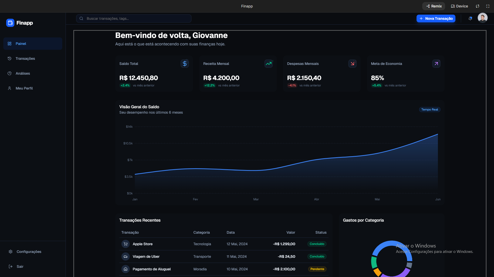

# 💰 Finapp: Dashboard de Gestão Financeira

## 📝 Descrição do Projeto
O **Finapp** é uma plataforma moderna e intuitiva focada na gestão financeira pessoal e empresarial. O sistema centraliza o controle de receitas e despesas, oferecendo um painel de navegação fluido para o acompanhamento em tempo real do fluxo de caixa e da saúde financeira do usuário.

Desenvolvido com uma interface elegante em *Dark Mode* nativo, o dashboard processa métricas financeiras críticas, categoriza **Transações** de forma inteligente e gera **Análises** detalhadas. A arquitetura foi pensada para entregar alta performance e uma experiência de usuário (UX) premium, permitindo tomadas de decisão rápidas e baseadas em dados.

---

*Figura 1: Interface principal do Painel.*

## 🚀 Tecnologias Utilizadas
* **Frontend:** React + TypeScript + Vite
* **Estilização:** Tailwind CSS (Arquitetura Utilitária voltada para Dark Theme)
* **Backend & Auth:** Firebase (Autenticação de Usuários & Firestore para banco de dados em tempo real)
* **Analytics & Gráficos:** Recharts para visualização de dados financeiros
* **Gerenciamento de Estado:** Context API / Zustand
* **Roteamento:** React Router DOM

## 📊 Resultados e Funcionalidades
O projeto foi estruturado para garantir precisão contábil e praticidade no uso diário:
* **Painel Centralizado:** Visão holística do saldo atual, atalhos de navegação e resumo das movimentações recentes.
* **Gestão de Transações:** Registro detalhado de entradas e saídas, com filtros por data, valor e categoria.
* **Módulo de Análises:** Gráficos interativos que mapeiam o comportamento de gastos e identificam tendências de consumo ao longo do tempo.
* **Segurança e Perfil:** Área dedicada ao "Meu Perfil" e "Configurações" para customização de preferências e proteção de dados sensíveis.

## 🔧 Como Executar
1. Clone o repositório: `git clone https://github.com/seu-usuario/finapp.git`.
2. Configure as credenciais do Firebase (ou do seu backend) no arquivo `.env` na raiz do projeto.
3. Instale as dependências executando: `npm install` ou `yarn install`.
4. Inicie o servidor de desenvolvimento: `npm run dev` ou `yarn dev`.

---
[Voltar ao início](https://github.com/GiovanneRenato/portfolio-giovanne-renato-da-silva-vieira)
